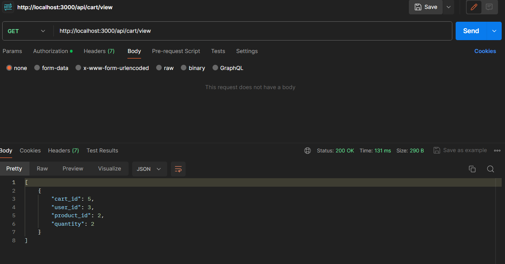

# Triveous

Backend E-commerce API

To run the project

- clone the repository
- inside the main repository directory open new terminal
- run `npm install`
- run `nodemon index.js`

- for first time runners, you may change the connection string (i got mine from ElephantSQL).
  - run `node ./Config/insertData.js` only once this will automatically insert data inside categories and products table

API endpoints(tested on POSTMAN)

- /register
  - {
    "username":"userName",
    "email": "Email",
    "password": "Password"
    }
  - above json object to be added in body section in raw tab
  - method -> POST

- /login
  - {
    "email": "Email",
    "password": "Password"
    }
  - above json object to be added in body section in raw tab
  - method -> POST

- /api

  - except above two rest routes are protected
  - /api acts as middleware
  - in POSTMAN be sure to add bearer token as whatever token in returned by login route

- /api/categories
  - method -> GET
  - fetches all categories available

- /api/products
  - method -> GET
  - {
    "category_id": "2"
    }
  - fetches all products available for that category

- /api/products/:productId
  - method -> GET
  - fetches product based on id's

- /api/cart/add
  - method -> POST
  - {
    "userId": "1",
    "productId": "1",
    "quantity": "2"
    }
  - adds item to cart table

- /api/cart/view
  - method -> GET
  - fetches userId stored in jwt token and gives cart detail w.r.t. specific user

- /api/cart/update
  - method -> POST
  - update quantity of item, if quantity is less than zero it deletes that item

- /api/orders/place 
    - method -> POSt 
    -   {
            "items": [
                {
                    "product_id": 1,
                    "quantity": 2,
                    "price": 10.99
                },
                {
                    "product_id": 2,
                    "quantity": 1,
                    "price": 29.99
                }
            ]
        }
    - adds items into order_item table and order in Order table

- /api/orders/history
    - method -> GET
    - fethes all order based on userId

- /api/orders/:orderId
    - method -> GET
    - fethches order based on order id

**feel free to connect with me regarding project